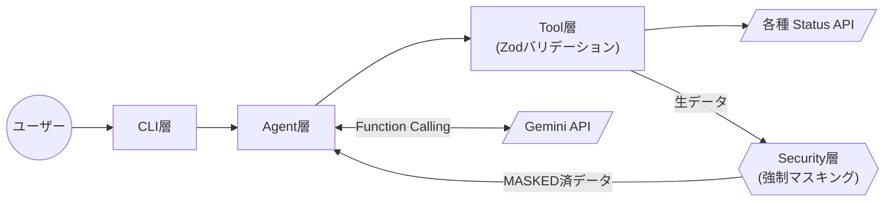
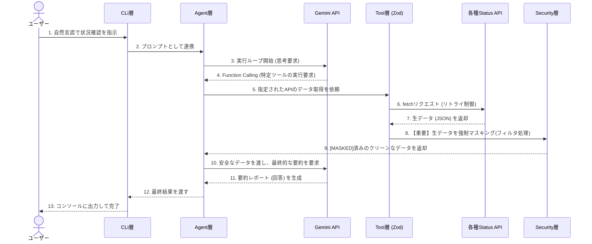

# インシデント初動対応エージェント (Oncall CLI Agent)

深夜や休日のインシデント発生時において、インフラエンジニアの初動調査 (複数ステータスの確認と報告用データの出力) を補助するCLIベースのAIエージェントです。

（※本プロジェクトの設計・実装には、AIエージェントを壁打ち相手・コーディングパートナーとして活用しています。アプローチの詳細はセクション5をご参照ください）

## 1. プロダクト概要

### 目的

オンコール対応時の初動調査を簡易化・高速化し、エンジニアの認知負荷を下げること。

どのサービスの状況を調べるかをAIが自律的に判定し、対象のAPIから取得した情報を安全にマスキングした上でシンプルに出力します。

### 想定ユーザーと業務シナリオ

* **想定ユーザー:** 睡眠中等に緊急のアラートを受け取り、即座に状況把握が求められるインフラエンジニア・保守担当者。

* **業務シナリオ:**

  深夜2時にサーバー障害のアラートを受信。

  担当者はブラウザを開いて複数のステータスダッシュボードを巡回する代わりに、ターミナルから本ツールに対し自然言語で指示を入力します。

  エージェントが自律的に必要なAPIを選択して状況を取得し、機密情報をマスキングした上で、社内報告への転記に適した形式で一次情報を出力します。

  緊急時の認知負荷と手作業によるヒューマンエラーを削減することを目的としています。

### 主な機能

* 自然言語による曖昧な指示からの対象サービス自動判定 (Function Calling)
* 対応サービスの公式ステータスAPIからの情報自動取得
* `[MASKED]` フィルターによる機密情報 (IPアドレス, API Key等) の防衛線
* 障害チケットへのコピペ用生データと、人間向け要約の同時出力
* 表記揺れ（ひらがな・カタカナ・大文字等）をZodで確実に吸収する入力バリデーション
* トラブル時の無限ループやAPI無料枠上限（429エラー）に対応するフェイルセーフ機構
* 裏側の思考プロセスと強制マスキングの挙動を可視化するデバッグ機能 (`--debug` フラグ)

## 2. アーキテクチャと技術選定の理由

本ツールは、純粋な TypeScript と Bun を用いて実装しています。

### 選定したAI API: Google Gemini API (gemini-2.5-flash)

* **選定理由:** シンプルな一次情報しか使用しないことと、応答速度に優れていると考えたため。
  
  インシデント初動対応という速度が求められる要件に最も適していると判断しました。

### ランタイム / ライブラリの選定理由

* **Bun:** 超高速な実行速度に加え、単一バイナリとしてコンパイル（`bun build --compile`）することで、一度ビルドを行えば次回以降は即座に呼び出せる運用が可能な点、課題要件との親和性から選定しました。

* **Zod:** LLMの出力（引数）の表記ゆれを `preprocess` / `transform` で吸収し、外部APIから取得したデータの型を保証する厳格なバリデーションパイプラインとして採用しています。

* **Bunテストランナー (`bun test`):** 外部ライブラリに依存せず、ゼロ設定でセキュリティ層・バリデーション層の品質を単体テストできるため採用しました。

### アーキテクチャ

#### システム構成図



#### シーケンス図



### 構成

コードは機能ごとに以下の層に分割し、保守性と拡張性を確保しています。

```text
oncall-cli-charrenge/
├── src/
│   ├── cli/
│   │   └── index.ts        # 【CLI / UI層】入力受付、ヘルプ表示(-h)、結果出力
│   ├── core/
│   │   ├── agent.ts        # 【Agent層】LLMのFunction Callingによる自律ループ
│   │   ├── masking.ts      # 【Security層】取得情報の強制マスキング（IP/トークン等）
│   │   └── masking.test.ts # 【単体テスト】マスク処理のテスト
│   └── tools/
│       ├── index.ts        # 【Tool層】Zodバリデーションと外部API通信・リトライ
│       └── index.test.ts   # 【単体テスト】バリデーションのテスト
├── Docs/                   # 開発ログ(ADR)やテスト検証結果
├── .env.example            # 環境変数の雛形
└── README.md               # 本ドキュメント
```

この分離により、将来的にCLI層をHono等のWeb APIフレームワークに差し替えても、Agent層・Tool層・Security層はそのまま流用可能です。

## 3. 設計意図（工夫した点）

本課題において、自身の理解度と提示された時間、実際の利便性を考慮し、Web UI等ではなくCLIベースで以下の点に注力しました。

1. **機密情報の保護（マスキング処理の実装）**
   業務利用において最も致命的な、生ログやIPアドレス、API Key等の機密情報を誤って外部のLLMに送信してしまうリスクを防ぐため、Tool層からAgent層にデータを渡す前段に、正規表現による強制置換（`[MASKED]`）を行うSecurity層を設けています。

2. **UI**
   緊急時にマウス操作やブラウザの描画を待つ時間は心理的負担になると考え、ターミナルからコマンド一発で結果を得るというシンプルな形を選択しました。

   さらに `bun build --compile` によって手元で一度ビルドしておくだけで、次回以降はNode/Bun環境依存すらなく超高速に呼び出せる仕組み（Zero-setup）を実現しています。

   上記により、実務に参加したての初学者であっても、障害発生時の確認作業の際にコマンド入力によるエラー(引数ミス・タイポ)や、API取得先のタイポのリスクを低減・省略し、業務へのストレス軽減と対応速度向上を目的としました。

3. **対応サービス追加の容易さ**
   新しいサービスのAPIに対応したい場合、推論ロジック（Agent層）を修正する必要がないよう設計しました。

   `src/tools/index.ts` の以下の2箇所に1行ずつ追加するだけで安全に拡張できます。
   1. `ServiceEnum` にサービス名を登録（Zodバリデーション用）
   2. `SERVICE_ENDPOINTS` に連携先のURLを登録

## 4. セットアップ手順と使い方

### 初回ビルドと実行

初回のみ手元でバイナリをビルドしていただくことで、次回以降はコマンド一発で即座に呼び出せるようになります。
[Git](https://git-scm.com/) と [Bun](https://bun.sh/) のインストール環境が必要です。

#### 1. リポジトリのクローンと依存解決

```bash
git clone https://github.com/Kafk-A-noob/oncall-cli-charrenge.git
cd oncall-cli-charrenge
bun install
```

#### 2. 環境変数の設定

`.env.example` をコピーして `.env` ファイルを作成し、Gemini API キーを設定してください。

```bash
cp .env.example .env
# .env ファイルを開き、GEMINI_API_KEY="your_api_key" を設定
```

#### 3. バイナリのビルドと実行

手元で一度ビルドしておくだけで、次回以降は即座に呼び出せるようになります。

```bash
# バイナリの生成（Windowsの場合は oncall.exe が出力されます）
bun build --compile src/cli/index.ts --outfile oncall

# ヘルプと使い方の表示
./oncall -h

# 状況の調査
./oncall "GitHubの障害状況はどうなってる？"
```

### 開発者向け（ソースからの直接実行・テスト）

ソースコードのまま実行したい場合や、品質保証用テストを行う場合の手順です。

```bash
# ソースコードから直接実行
bun run start "GitHubの状況は？"

# 自動単体テスト(Unit Test)の実行
bun test
```

## 5. 開発のアプローチ（生成AIの活用）

本プロジェクトは、システム設計と実装の全工程において生成AIを活用して構築されました。
AIコーディング特有のリスク（機密情報の漏洩、ハルシネーションによる無限ループ課金等）を回避するため、実装の丸投げは避け、AIと議論しながら、セキュリティ（マスキング）層の手前配置、フェイルセーフの設計、Zodによる入力の厳格なサニタイズをアーキテクチャの段階から組み込むようにコントロールして開発を進めました。

## 6. 開発・テスト資料

システムの設計意図やテストケースについては、`Docs/` ディレクトリをご確認ください。

* `Docs/development/`: 各フェーズの設計・開発ログ
* `Docs/testing/`: 結合テストの全シナリオと結果

---
**25R1116 = Kafk-A-noob**
